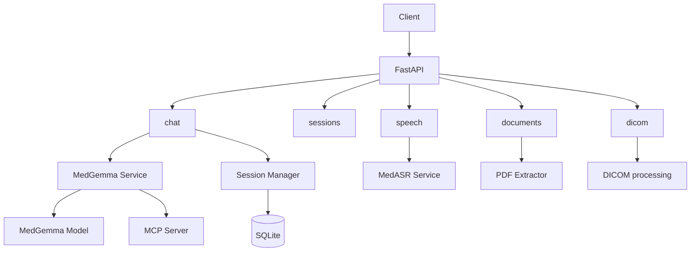

# MedCompanion Server

FastAPI server for MedCompanion: MedGemma chat, MedASR, sessions, document/PDF processing, DICOM, and MCP tools.

## Features

- Multi-modal chat (text and medical images) with streaming (SSE)
- Session management with persistent conversation history (SQLite)
- REST API for health, sessions, chat, documents, speech, and DICOM
- MedGemma 4B instruction-tuned multimodal model (text + image)
- MedASR speech-to-text (United-MedASR, sub–1% WER on standard benchmarks)
- Domain/mode system prompts (general, radiology, pathology, dermatology × consult / plan / diagnose)
- Workspace-based document scan for summarize mode; PDF text extraction with caching
- MCP (Model Context Protocol) tools for deterministic arithmetic and calculations

## Request Flow



## Setup

### 1. System dependencies

For voice transcription:

```bash
brew install ffmpeg
```

### 2. Python environment

From the `Backend` directory (or repo root with `Backend` on path):

```bash
# Create and activate a virtual environment, then:
pip install -r requirements.txt
```

### 3. Configuration

Copy `.env.example` to `.env` and adjust if needed:

```bash
cp .env.example .env
```

### 4. Run the server

```bash
python -m server.main
```

Or with uvicorn:

```bash
uvicorn server.main:app --host 0.0.0.0 --port 8000 --reload
```

API: `http://localhost:8000`.

## API Documentation

- **Swagger UI:** http://localhost:8000/docs  
- **ReDoc:** http://localhost:8000/redoc  

## API Routes

| Area | Endpoints |
|------|-----------|
| Health | `GET /api/v1/health` |
| Sessions | `POST/GET/DELETE /api/v1/sessions` |
| Chat | `POST /api/v1/chat`, `POST /api/v1/chat/stream` |
| Documents | `POST /api/v1/documents/preprocess-pdfs`, `POST /api/v1/documents/clear-pdf-cache` |
| Speech | `POST /api/v1/speech/transcribe` (multipart audio; mono 16 kHz; lazy-loaded) |
| DICOM | `POST /api/v1/dicom/process-series` |
| Images | `POST /api/v1/images` (multipart) |

Chat accepts optional `domain`, `mode`, `image_path`, `workspace_path`. Sessions: create with `{"title": "My Session"}`, then GET/DELETE by `session_id`.

## MedASR

Service: `server/services/medasr.py`. Speech endpoint (see table above); mono 16 kHz audio. United-MedASR: sub–1% WER on standard benchmarks. arXiv:2412.00055.

## MedGemma

- **Model:** google/medgemma-4b-it (multimodal, instruction-tuned).  
- **Context window:** 128K+ tokens.  
- **Image handling:** 896×896 normalization; SigLIP vision encoder.  
- **Benchmarks (arXiv:2507.05201):** MedQA 64.4, MedMCQA 55.7, PubMedQA 73.4.  
- **Device:** Auto-detected (MPS/CUDA/CPU). ~12–16 GB RAM for full precision. Text-only queries use a dummy image internally.

## MCP (Model Context Protocol)

Deterministic operations (arithmetic, dose calculations) are delegated to an MCP server; tool schemas are injected into the model context and the backend calls the server for execution. Package: `mcp_server/`. Details: [mcp_server/README.md](mcp_server/README.md), [docs/mcp-architecture-overview.md](docs/mcp-architecture-overview.md).

## Domain and mode prompts

File-based under `server/prompts/`: `_base.txt`, `_default.txt`, and per-domain/mode (e.g. `general/consult.txt`, `radiology/diagnose.txt`) for general, radiology, pathology, dermatology. Summarize mode can pass `workspace_path` to include workspace MD and cached PDF in context.

## PDF extraction

`server/services/pdf_extractor.py` extracts and caches PDF text under `server/temp/pdf_cache/`. Documents router: preprocess and clear-cache. Summarize mode’s workspace scan uses this cache (TTL applies).

## Project structure

```
Backend/
├── server/
│   ├── main.py              # FastAPI app
│   ├── config.py            # Settings
│   ├── api/
│   │   ├── routes/          # chat, sessions, dicom, documents, speech
│   │   └── schemas/
│   ├── services/            # medgemma, medasr, session_manager, pdf_extractor, document_scanner, system_prompts
│   ├── db/
│   ├── prompts/            # Domain/mode prompt files
│   └── temp/                # PDF cache, DICOM output
├── mcp_server/              # MCP arithmetic (and other) tools
├── docs/                    # Architecture and manual testing
└── requirements.txt
```

## Testing

- **Manual testing:** Curl examples and domain/mode coverage are in [docs/manual-testing.md](docs/manual-testing.md).  
- **Quick checks:**

```bash
curl http://localhost:8000/api/v1/health

SESSION_ID=$(curl -s -X POST http://localhost:8000/api/v1/sessions \
  -H "Content-Type: application/json" \
  -d '{"title": "Test"}' | jq -r '.session_id')

curl -X POST http://localhost:8000/api/v1/chat \
  -H "Content-Type: application/json" \
  -d "{\"session_id\": \"$SESSION_ID\", \"message\": \"What is hemoglobin?\"}"
```

- **Unit tests:** From `Backend`: `pytest` (e.g. `server/tests/test_system_prompts.py`).

## Sample documents

`test_patient_history.md`, `test_lab_results.md`, `test_consultation_notes.md` in `Backend/` are sample inputs for summarize mode. Pass a `workspace_path` that includes them (or your own docs) in the chat request.

## Performance

Typical offline timings (M4 Max; varies with context and quantization):

- ASR throughput: ~0.45 s compute per 60 s audio  
- Generation speed: ~12 tokens/s  
- PDF question → grounded answer: ~4 s  
- DICOM question → multimodal answer: ~7 s  

## Development

```bash
pip install pytest httpx
pytest
```

## License

See the LICENSE file in the repository.

## Disclaimer

This server is for research and development only. It is not intended for direct clinical use without appropriate validation and regulatory oversight.
