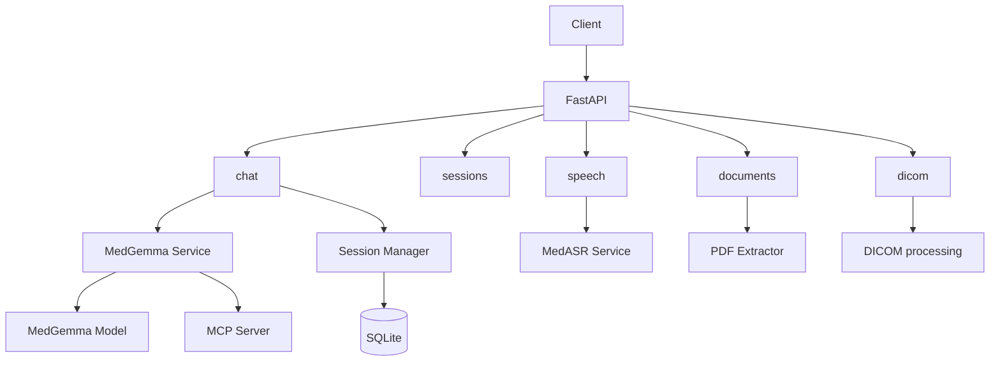

# MedCompanion Server

FastAPI server for the MedCompanion backend: MedGemma multimodal chat, MedASR speech transcription, session management, document and PDF processing, DICOM processing, and MCP-based deterministic tools.

## Features

- Multi-modal chat (text and medical images) with streaming (SSE)
- Session management with persistent conversation history (SQLite)
- REST API for health, sessions, chat, documents, speech, and DICOM
- MedGemma 4B instruction-tuned multimodal model (text + image)
- MedASR speech-to-text (United-MedASR, sub–1% WER on standard benchmarks)
- Domain/mode system prompts (general, radiology, pathology, dermatology × consult / plan / diagnose)
- Workspace-based document scan for summarize mode; PDF text extraction with caching
- MCP (Model Context Protocol) tools for deterministic arithmetic and calculations

## Request Flow



## Setup

### 1. System dependencies

For voice transcription:

```bash
brew install ffmpeg
```

### 2. Python environment

From the `Backend` directory (or repo root with `Backend` on path):

```bash
# Create and activate a virtual environment, then:
pip install -r requirements.txt
```

### 3. Configuration

Copy `.env.example` to `.env` and adjust if needed:

```bash
cp .env.example .env
```

### 4. Run the server

```bash
python -m server.main
```

Or with uvicorn:

```bash
uvicorn server.main:app --host 0.0.0.0 --port 8000 --reload
```

The API is available at `http://localhost:8000`.

## API Documentation

- **Swagger UI:** http://localhost:8000/docs  
- **ReDoc:** http://localhost:8000/redoc  

## API Routes

Routers included in the app: `chat`, `sessions`, `dicom`, `documents`, `speech`.

| Area | Endpoints |
|------|-----------|
| Health | `GET /api/v1/health` |
| Sessions | `POST/GET/DELETE /api/v1/sessions` |
| Chat | `POST /api/v1/chat`, `POST /api/v1/chat/stream` |
| Documents | `POST /api/v1/documents/preprocess-pdfs`, `POST /api/v1/documents/clear-pdf-cache` |
| Speech | `POST /api/v1/speech/transcribe` |
| DICOM | `POST /api/v1/dicom/process-series` |
| Images | `POST /api/v1/images` (multipart) |

### Health

```bash
GET /api/v1/health
```

### Sessions

Create: `POST /api/v1/sessions` with body `{"title": "My Session"}`.  
List: `GET /api/v1/sessions`. Get one: `GET /api/v1/sessions/{session_id}`. Delete: `DELETE /api/v1/sessions/{session_id}`.

### Chat

Send message (optionally with `domain`, `mode`, `image_path`, `workspace_path`):

```bash
POST /api/v1/chat
POST /api/v1/chat/stream
```

### Speech (MedASR)

`POST /api/v1/speech/transcribe` — multipart form data with audio (mono 16 kHz recommended). MedASR loads on first use (lazy).

## MedASR

- **Service:** `server/services/medasr.py`  
- **Endpoint:** `POST /api/v1/speech/transcribe`  
- **Input:** Mono 16 kHz audio.  
- **Reference:** United-MedASR reports sub–1% WER on multiple benchmarks (e.g. LibriSpeech test-clean 0.985%, Europarl-ASR 0.26%). See arXiv:2412.00055.

## MedGemma

- **Model:** google/medgemma-4b-it (multimodal, instruction-tuned).  
- **Context window:** 128K+ tokens.  
- **Image handling:** 896×896 normalization; SigLIP vision encoder.  
- **Benchmarks (arXiv:2507.05201):** MedQA 64.4, MedMCQA 55.7, PubMedQA 73.4.  
- **Device:** Auto-detected (MPS/CUDA/CPU). ~12–16 GB RAM for full precision. Text-only queries use a dummy image internally.

## MCP (Model Context Protocol)

Deterministic operations (e.g. arithmetic, dose calculations) are delegated to an MCP server so the LLM receives exact results instead of generating math. Tool schemas are injected into the model context; the backend can call the MCP server for execution.

- **Server package:** `mcp_server/` (e.g. arithmetic tools).  
- **Docs:** [mcp_server/README.md](mcp_server/README.md) and [docs/mcp-architecture-overview.md](docs/mcp-architecture-overview.md) (system architecture and data flow).

## Domain and mode prompts

System prompts are file-based under `server/prompts/`: `_base.txt`, `_default.txt`, and per-domain/mode files (e.g. `general/consult.txt`, `radiology/diagnose.txt`) for general, radiology, pathology, and dermatology. Summarize mode can use a `workspace_path` to scan and include workspace documents (MD and cached PDF) in context.

## PDF extraction

`server/services/pdf_extractor.py` extracts text from PDFs and caches it under `server/temp/pdf_cache/`. The documents router exposes preprocess and cache-clear endpoints. Workspace document scan (for summarize) uses this cache with a TTL.

## Project structure

```
Backend/
├── server/
│   ├── main.py              # FastAPI app
│   ├── config.py            # Settings
│   ├── api/
│   │   ├── routes/          # chat, sessions, dicom, documents, speech
│   │   └── schemas/
│   ├── services/            # medgemma, medasr, session_manager, pdf_extractor, document_scanner, system_prompts
│   ├── db/
│   ├── prompts/            # Domain/mode prompt files
│   └── temp/                # PDF cache, DICOM output
├── mcp_server/              # MCP arithmetic (and other) tools
├── docs/                    # Architecture and manual testing
└── requirements.txt
```

## Testing

- **Manual testing:** Curl examples and domain/mode coverage are in [docs/manual-testing.md](docs/manual-testing.md).  
- **Quick checks:**

```bash
curl http://localhost:8000/api/v1/health

SESSION_ID=$(curl -s -X POST http://localhost:8000/api/v1/sessions \
  -H "Content-Type: application/json" \
  -d '{"title": "Test"}' | jq -r '.session_id')

curl -X POST http://localhost:8000/api/v1/chat \
  -H "Content-Type: application/json" \
  -d "{\"session_id\": \"$SESSION_ID\", \"message\": \"What is hemoglobin?\"}"
```

- **Unit tests:** From `Backend`: `pytest` (e.g. `server/tests/test_system_prompts.py`).

## Sample documents for summarize mode

Sample medical documents (e.g. for testing summarize mode) are in the repo under `Backend/`: `test_patient_history.md`, `test_lab_results.md`, `test_consultation_notes.md`. Use a `workspace_path` that includes these (or your own) when calling chat with summarize mode.

## Performance (Apple M4 Max)

Typical offline timings (varies with context size and quantization):

- TTFT: ~30 ms  
- Generation: ~20 tokens/s  
- Dictation → transcript → summary draft: ~15 s  
- PDF question → grounded answer: ~3 s  
- DICOM question → multimodal answer: ~5 s  

## Development

```bash
pip install pytest httpx
pytest
```

## License

See the LICENSE file in the repository.

## Disclaimer

This server is for research and development only. It is not intended for direct clinical use without appropriate validation and regulatory oversight.
