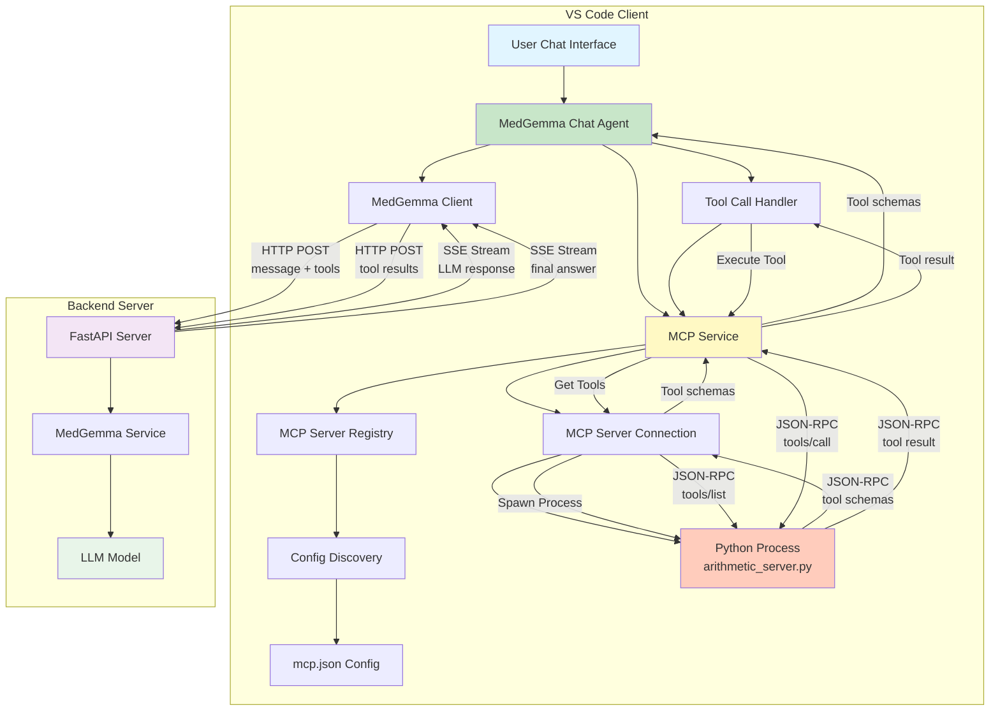
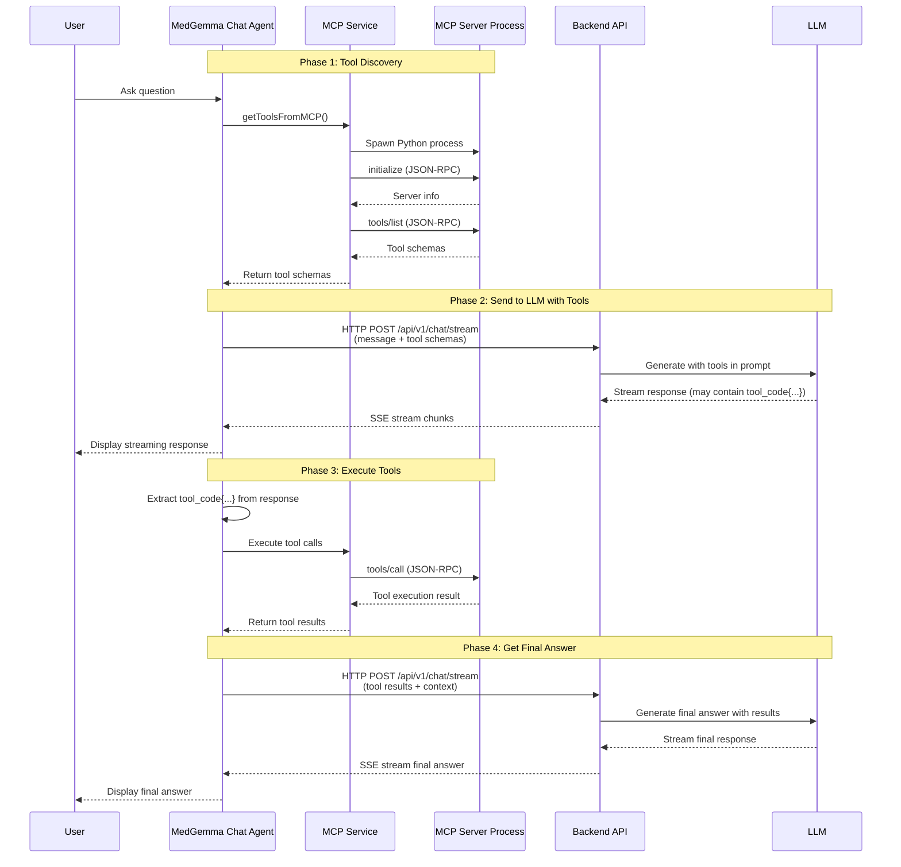

# MCP Server Architecture Overview

## System Architecture

```mermaid
graph TB
    subgraph "VS Code Client"
        A[User Chat Interface] --> B[MedGemma Chat Agent]
        B --> C[MedGemma Client]
        B --> D[Tool Call Handler]
        B --> E[MCP Service]
        E --> F[MCP Server Registry]
        F --> G[Config Discovery]
        G --> H[mcp.json Config]
        E --> I[MCP Server Connection]
        I --> J[Python Process<br/>arithmetic_server.py]
        D --> E
    end
    
    subgraph "Backend Server"
        K[FastAPI Server] --> L[MedGemma Service]
        L --> M[LLM Model]
    end
    
    C -->|HTTP POST<br/>message + tools| K
    K -->|SSE Stream<br/>LLM response| C
    C -->|HTTP POST<br/>tool results| K
    K -->|SSE Stream<br/>final answer| C
    
    E -->|Get Tools| I
    I -->|Spawn Process| J
    I -->|JSON-RPC<br/>tools/list| J
    J -->|JSON-RPC<br/>tool schemas| I
    I -->|Tool schemas| E
    E -->|Tool schemas| B
    
    D -->|Execute Tool| E
    E -->|JSON-RPC<br/>tools/call| J
    J -->|JSON-RPC<br/>tool result| E
    E -->|Tool result| D
    
    style A fill:#e1f5ff
    style B fill:#c8e6c9
    style E fill:#fff9c4
    style K fill:#f3e5f5
    style J fill:#ffccbc
    style M fill:#e8f5e9
```

## Complete Data Flow

```mermaid
sequenceDiagram
    participant User
    participant ChatAgent as MedGemma Chat Agent
    participant MCPClient as MCP Service
    participant MCPServer as MCP Server Process
    participant Backend as Backend API
    participant LLM
    
    Note over ChatAgent,MCPServer: Phase 1: Tool Discovery
    User->>ChatAgent: Ask question
    ChatAgent->>MCPClient: getToolsFromMCP()
    MCPClient->>MCPServer: Spawn Python process
    MCPClient->>MCPServer: initialize (JSON-RPC)
    MCPServer-->>MCPClient: Server info
    MCPClient->>MCPServer: tools/list (JSON-RPC)
    MCPServer-->>MCPClient: Tool schemas
    MCPClient-->>ChatAgent: Return tool schemas
    
    Note over ChatAgent,LLM: Phase 2: Send to LLM with Tools
    ChatAgent->>Backend: HTTP POST /api/v1/chat/stream<br/>(message + tool schemas)
    Backend->>LLM: Generate with tools in prompt
    LLM-->>Backend: Stream response (may contain tool_code{...})
    Backend-->>ChatAgent: SSE stream chunks
    ChatAgent-->>User: Display streaming response
    
    Note over ChatAgent,MCPServer: Phase 3: Execute Tools
    ChatAgent->>ChatAgent: Extract tool_code{...} from response
    ChatAgent->>MCPClient: Execute tool calls
    MCPClient->>MCPServer: tools/call (JSON-RPC)
    MCPServer-->>MCPClient: Tool execution result
    MCPClient-->>ChatAgent: Return tool results
    
    Note over ChatAgent,LLM: Phase 4: Get Final Answer
    ChatAgent->>Backend: HTTP POST /api/v1/chat/stream<br/>(tool results + context)
    Backend->>LLM: Generate final answer with results
    LLM-->>Backend: Stream final response
    Backend-->>ChatAgent: SSE stream final answer
    ChatAgent-->>User: Display final answer
```
