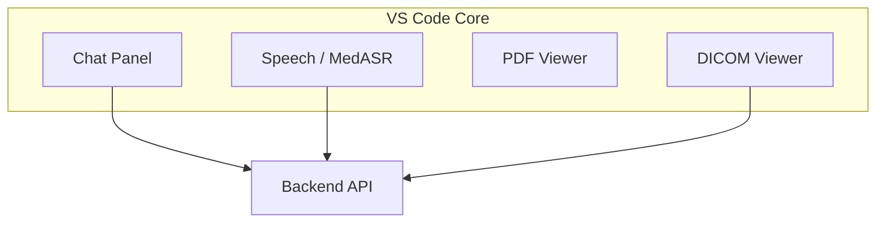

# MedCompanion Frontend (IDE)

MedCompanion IDE is a VS Code (Code–OSS) fork with medical-workflow customizations: chat, PDF and DICOM viewers, Add Context, and role presets. The backend at `http://localhost:8000` is used by chat, speech (MedASR), and the DICOM viewer; the PDF viewer runs entirely in the IDE.

## Overview

- **Chat panel** — MedGemma-backed streaming chat; text, images, and optional context (e.g. PDF text via "Add PDF Clipboard to Chat").
- **Speech (MedASR)** — Transcription via the backend speech endpoint.
- **PDF viewer** — PDF.js viewer with text selection and "Add PDF Clipboard to Chat" (Ctrl+Shift+V / Cmd+Shift+V). Pasted text is sent to the backend only when you submit a chat message.
- **DICOM viewer** — Viewer for `.dcm` with slice navigation; uses backend to process series.


## MedCompanion-Specific Code

| Area | Location |
|------|----------|
| Chat + MedGemma client | `src/vs/workbench/contrib/chat/` — `medgemma/medgemmaClient.ts` calls `POST /api/v1/chat` and `POST /api/v1/chat/stream` |
| Speech (MedASR) | `src/vs/workbench/contrib/speech/browser/medgemma/medASRSpeechProvider.ts` — extension `medcompanion.medasr`; calls `POST /api/v1/speech/transcribe` |
| Product branding | `product.json` — `nameShort`, `applicationName`, `dataFolderName`, etc. set to MedCompanion |
| PDF viewer extension | `extensions/pdf-viewer` — PDF.js; “Add PDF Clipboard to Chat” (e.g. Ctrl+Shift+V / Cmd+Shift+V) |
| DICOM viewer extension | `extensions/dicom-viewer` — viewer for `.dcm`; backend processes series |

## Architecture



## Build and Run

**Prerequisites:** Node.js and yarn. Backend at `http://localhost:8000` required for chat, speech, and DICOM.

1. Install dependencies:
   ```bash
   yarn install
   ```
2. Build (including extensions):
   ```bash
   yarn compile
   ```
   Or use the full script:
   ```bash
   ./scripts/code.sh
   ```
3. Run the IDE (same script typically builds and runs):
   ```bash
   ./scripts/code.sh
   ```

## Building from Source

For full build and run from source (including native modules and the complete VS Code build pipeline), see the upstream guide: [How to Contribute to VS Code](https://github.com/microsoft/vscode/wiki/How-to-Contribute).

## Configuration

- **Backend URL** — Default `http://localhost:8000`; set where the MedGemma client is configured.
- **DICOM viewer** — `dicomViewer.serverUrl` in settings overrides the server URL (see `extensions/dicom-viewer/package.json`).

## Documentation

- Root project: [../README.md](../README.md)  
- Backend API and setup: [../Backend/README.md](../Backend/README.md)  
- PDF viewer extension: [extensions/pdf-viewer/README.md](extensions/pdf-viewer/README.md)  
- DICOM viewer extension: [extensions/dicom-viewer/README.md](extensions/dicom-viewer/README.md)  

This frontend is based on [VS Code Open Source (“Code - OSS”)](https://github.com/microsoft/vscode).
