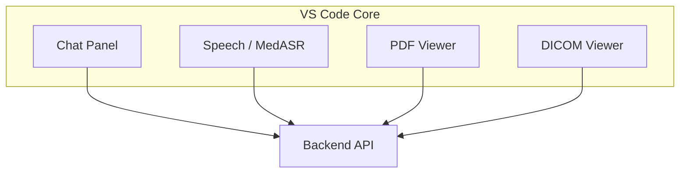

# MedCompanion Frontend (IDE)

MedCompanion IDE is a VS Code (Code–OSS) fork with medical-workflow customizations. It provides a single workspace for chat, PDF viewing, DICOM viewing, Add Context, and role presets, and communicates with the MedCompanion backend for transcription, document processing, and multimodal reasoning.

## Overview

The frontend consists of the VS Code workbench plus MedCompanion-specific contributions:

- **Chat panel** — MedGemma-backed chat with streaming; supports text and images and optional context from PDF/DICOM.
- **Speech (MedASR)** — Built-in transcription via the backend speech endpoint.
- **PDF viewer** — Built-in viewer (PDF.js) with text selection and an “Add PDF Clipboard to Chat” command.
- **DICOM viewer** — Custom editor for `.dcm` files with slice navigation and backend processing.

All of these use the backend at `http://localhost:8000` by default.

## MedCompanion-Specific Code

| Area | Location |
|------|----------|
| Chat + MedGemma client | `src/vs/workbench/contrib/chat/` — `medgemma/medgemmaClient.ts` calls `POST /api/v1/chat` and `POST /api/v1/chat/stream` |
| Speech (MedASR) | `src/vs/workbench/contrib/speech/browser/medgemma/medASRSpeechProvider.ts` — extension `medcompanion.medasr`; calls `POST /api/v1/speech/transcribe` |
| Product branding | `product.json` — `nameShort`, `applicationName`, `dataFolderName`, etc. set to MedCompanion |
| PDF viewer extension | `extensions/pdf-viewer` — PDF.js viewer; “Add PDF Clipboard to Chat” (e.g. Ctrl+Shift+V / Cmd+Shift+V) |
| DICOM viewer extension | `extensions/dicom-viewer` — custom editor for `.dcm`; calls `POST /api/v1/dicom/process-series` |

## Architecture



## Build and Run

**Prerequisites:** Node.js and yarn. The MedCompanion backend must be running at `http://localhost:8000` for chat, speech, and DICOM.

1. Install dependencies:
   ```bash
   yarn install
   ```
2. Build (including extensions):
   ```bash
   yarn compile
   ```
   Or use the full script:
   ```bash
   ./scripts/code.sh
   ```
3. Run the IDE (same script typically builds and runs):
   ```bash
   ./scripts/code.sh
   ```

## Building from Source

For full build and run from source (including native modules and the complete VS Code build pipeline), see the upstream guide: [How to Contribute to VS Code](https://github.com/microsoft/vscode/wiki/How-to-Contribute).

## Configuration

- **Chat / backend URL** — Configured where the MedGemma client reads the server URL (default `http://localhost:8000`).
- **DICOM viewer** — Setting `dicomViewer.serverUrl` in settings (e.g. in `Frontend/.vscode/settings.json` or user settings) overrides the MedCompanion server URL. See `extensions/dicom-viewer/package.json` for the contribution schema.

## Documentation

- Root project: [../README.md](../README.md)  
- Backend API and setup: [../Backend/README.md](../Backend/README.md)  
- PDF viewer extension: [extensions/pdf-viewer/README.md](extensions/pdf-viewer/README.md)  
- DICOM viewer extension: [extensions/dicom-viewer/README.md](extensions/dicom-viewer/README.md)  

This frontend is based on [VS Code Open Source (“Code - OSS”)](https://github.com/microsoft/vscode).
