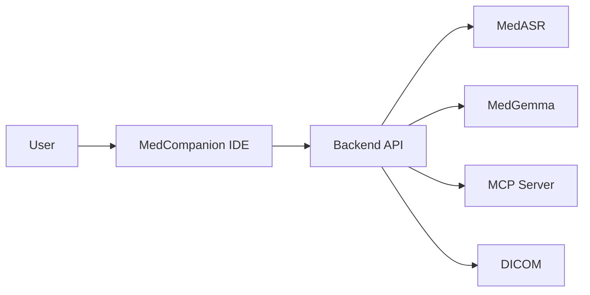

# MedCompanion

## Problem Statement

Modern healthcare workflows are fragmented and inefficient. Clinicians juggle multiple tasks and tools during patient care, leading to several pain points:

1. **Documentation burden** — A large portion of clinical time is spent on EHR and desk work (notes, summaries), contributing to burnout.
2. **Context switching** — Physicians use separate systems for dictation, medical imaging (e.g. PACS/DICOM), and reference (textbooks, PDF guidelines). Constant switching disrupts focus and can introduce errors.
3. **Limited real-time support** — Decision support (guidelines, risk scores) during encounters often requires internet or separate apps, which may be impractical in privacy-sensitive or low-connectivity environments.

Direct observation studies report physicians spend roughly half of office time on EHR/desk work versus about a quarter on direct clinical face time, with many completing 1–2 additional hours of clerical work nightly (Sinsky et al., *Annals of Internal Medicine*, 2016).

---

## Proposed Solution

MedCompanion is an **offline, multimodal clinical copilot** that consolidates core desk-work tasks—documentation, information retrieval, and image review—into a single workflow.

Clinicians can speak, read, view, ask, and compute in one integrated interface:

- **Documentation** — United-MedASR transcribes clinical speech; MedGemma 4B generates structured drafts (summaries, visit notes).
- **Unified workspace** — Built-in PDF and DICOM viewers allow analysis of documents and imaging in the same environment, reducing context switching.
- **Offline operation** — The system runs fully offline so PHI is not sent to external APIs. Deterministic operations (e.g. dosage math, risk scores) use MCP (Model Context Protocol) tools for exact arithmetic instead of LLM approximations.

---

## Repository Structure

| Component | Location |
|-----------|----------|
| **UI workspace** | `Frontend/` — VS Code–based MedCompanion IDE (chat, PDF/DICOM viewers, Add Context, role presets) |
| **MedASR service** | `Backend/server/services/medasr.py` — `POST /api/v1/speech/transcribe` |
| **Context builder** | Backend prompts and request assembly: `Backend/server/services/system_prompts.py`, chat request schemas |
| **MedGemma runtime** | `Backend/server/services/medgemma.py` |
| **MCP tool agent** | `Backend/mcp_server/` — deterministic tools; detailed flow: [Backend/docs/mcp-architecture-overview.md](Backend/docs/mcp-architecture-overview.md) |

---

## Architecture Overview

---

## Quick Start

1. **Prerequisites** — Python 3.10+, Node/yarn (Frontend), ffmpeg (speech).
2. **Backend** — From `Backend/`: create/activate venv, `pip install -r requirements.txt`, then `python -m server.main`. API at `http://localhost:8000`.
3. **Frontend** — From `Frontend/`: `yarn install`, then `./scripts/code.sh` (or `yarn compile` and run). IDE expects backend at `http://localhost:8000`.

---

## Performance

- **Transcription (United-MedASR)** — Sub–1% WER (e.g. LibriSpeech 0.985%, Europarl-ASR 0.26%). arXiv:2412.00055.
- **Clinical QA (MedGemma 4B)** — MedQA 64.4, MedMCQA 55.7, PubMedQA 73.4. arXiv:2507.05201.
- **Offline latency (M4 Max)** — ASR throughput: ~0.45 s compute per 60 s audio; generation speed: ~12 tokens/s; PDF question → grounded answer: ~4 s; DICOM question → multimodal answer: ~7 s.
- **Deterministic math** — Dose and risk calculations via MCP tools (exact), not LLM-only.

---

## References

- United-MedASR: arXiv:2412.00055  
- MedGemma 4B: arXiv:2507.05201  
- Sinsky et al., Allocation of Physician Time in Ambulatory Practice, *Annals of Internal Medicine*, 2016  
- Moy et al., Characterizing multitasking in clinical workflow, AMIA 2020  

---

## Impact, Risks, and Future Work

**Impact** — The project aims to reduce documentation drafting time and context-switching overhead in workflows where EHR/desk work dominates.

**Risks** — Hallucinations are mitigated by PDF grounding and clinician review; outputs are drafts with clinician-in-the-loop. Tool/prompt injection surface is limited via strict MCP schema validation.

**Future work** — Clinic-side evaluation, structured PDF extraction, longitudinal context indexing, expanded MCP clinical calculators with audit trails, and multi-image workflow hardening.

---

## Documentation

- **[Frontend/README.md](Frontend/README.md)** — IDE build, run, and MedCompanion-specific features.  
- **[Backend/README.md](Backend/README.md)** — API, setup, MedASR/MedGemma/MCP, and testing.

**Disclaimer** — This project is for research and development only. It is not intended for direct clinical use without appropriate validation and regulatory oversight.
